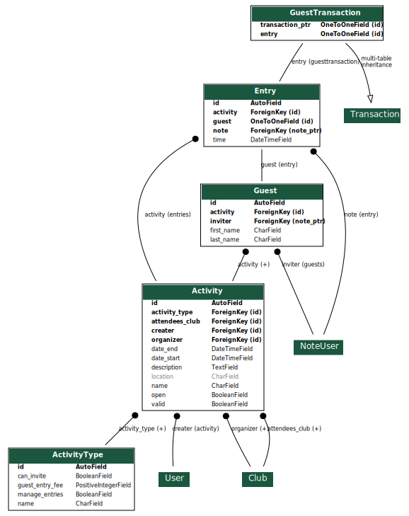

Application Activités
=====================

L'application activités gère les différentes activités liées au BDE. Elle permet entre autres de créer des activités qui
peuvent être diffusées via des calendriers ou la mailing list d'événements. Elle permet aussi de réguler l'accès aux
événements, en s'assurant que leur note est positive. Elle permet enfin de gérer les invités.

Modèles
-------

L'application comporte 5 modèles : activités, types d'activité, invités, entrées et transactions d'invitation.

Types d'activité
~~~~~~~~~~~~~~~~

Les activités sont triées par type (pots, soirées de club, ...), et chaque type regroupe diverses informations :

* Nom du type
* Possibilité d'inviter des non-adhérents (booléen)
* Prix d'invitation (entier, centimes à débiter sur la note de l'hôte)

Activités
~~~~~~~~~

Le modèle d'activité regroupe les informations liées à l'activité même :

* Nom de l'activité
* Description de l'activité
* Créateur, personne qui a proposé l'activité
* Club ayant organisé l'activité
* Note sur laquelle verser les crédits d'invitation (peut être nul si non concerné)
* Club invité (généralement le club Kfet)
* Date et heure de début
* Date et heure de fin
* Activité valide (booléen)
* Activité ouverte (booléen)

Entrées
~~~~~~~

Une instance de ce modèle est créé dès que quelqu'un est inscrit à l'activité. Sont stockées les informations suivantes :

* Activité concernée (clé étrangère)
* Heure d'entrée
* Note de la personne entrée, ou hôte s'il s'agit d'un invité (clé étrangère vers ``NoteUser``)
* Invité (``OneToOneField`` vers ``Guest``, ``None`` si c'est la personne elle-même qui rentre et non son invité)

Il n'est pas possible de créer une entrée si la note est en négatif.

Invités
~~~~~~~

Les adhérents ont la possibilité d'inviter des amis. Pour cela, les différentes informations sont enregistrées :

* Activité concernée (clé étrangère)
* Nom de famille
* Prénom
* Note de la personne ayant invité

Certaines contraintes s'appliquent :

* Une personne ne peut pas être invitée plus de 5 fois par an (coupe nom/prénom)
* Un adhérent ne peut pas inviter plus de 3 personnes par activité.

Transactions d'invitation
~~~~~~~~~~~~~~~~~~~~~~~~~

On étend le modèle ``Transaction`` de l'application note afin de supporter les transactions d'invitation. Elles ne
comportent qu'un champ supplémentaire, de type ``OneToOneField`` vers ``Guest``.

Ce modèle aurait pu appartenir à l'application ``note``, mais afin de rester modulaire et que l'application ``note``
ne dépende pas de cette application, on procède de cette manière.

Graphe
~~~~~~

UI
--

Création d'activités
~~~~~~~~~~~~~~~~~~~~

N'importe quel adhérent Kfet peut suggérer l'ajout d'une activité via un formulaire.

Gestion des activités
~~~~~~~~~~~~~~~~~~~~~

Les ayant-droit (Res[pot] et respos infos) peuvent valider les activités proposées. Ils peuvent également la modifier
si besoin. Ils peuvent enfin la déclarer ouvertes pour lancer l'accès aux entrées.

N'importe qui peut inviter des amis non adhérents, tant que les contraintes de nombre (un adhérent n'invite pas plus de
trois personnes par activité et une personne ne peut pas être invitée plus de 5 fois par an). L'invitation est
facturée à l'entrée.

Entrées aux soirées
~~~~~~~~~~~~~~~~~~~

L'interface d'entrées est simple et ergonomique. Elle contient un champ de texte. À chaque fois que le champ est
modifié, un tableau est affiché comprenant la liste des invités et des adhérents dont le prénom, le nom ou un alias
de la note est acceptée par le texte entré.

En cliquant sur la ligne de la personne qui souhaite rentrée, s'il s'agit d'un adhérent, alors la personne est comptée
comme entrée à l'activité, sous réserve que sa note soit positive. S'il s'agit d'un invité, alors 3 boutons
apparaîssent, afin de régler la taxe d'invitation : l'un prélève directement depuis la note de l'hôte, les deux autres
permettent un paiement par espèces ou par carte bancaire. En réalité, les deux derniers boutons enregistrent
automatiquement un crédit sur la note de l'hôte, puis une transaction (de type ``GuestTransaction``) est faite depuis
la note de l'hôte vers la note de l'organisateur de l'événement.
