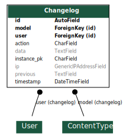

Logs
====

Chaque modification effectuée sur un modèle est enregistrée dans la base dans données.

Dès qu'un modèle veut être sauvegardé, deux signaux sont envoyés dans ``logs.signals`` : un avant et un après
la sauvegarde.
En pré-sauvegarde, on récupère l'ancienne version du modèle, si elle existe.
En post-sauvegarde, on récupère l'utilisateur et l'IP courants (voir ci-dessous), on convertit les modèles en JSON
et on enregistre une entrée ``Changelog`` dans la base de données.

Pour récupérer l'utilisateur et son IP, le middleware ``logs.middlewares.LogsMiddlewares`` récupère à chaque requête
l'utilisateur et l'adresse IP, et les stocke dans le processus courant, afin qu'ils puissent être
récupérés par les signaux.

Si jamais la modification ne provient pas d'une requête Web, on suppose qu'elle vient d'une instruction
lancée avec ``manage.py``.
On récupère alors le nom de l'utilisateur dans l'interface de commandes, et si une note est associée à cet alias,
alors on considère que c'est le détenteur de la note qui a effectué cette modification, sur l'adresse IP ``127.0.0.1``.
Sinon, le champ est laissé à ``None``.

Une entrée de ``Changelog`` contient les informations suivantes :

  * Utilisateur (``ForeignKey`` vers ``User``, nullable)
  * Adresse IP (``GenericIPAddressField``)
  * Type de modèle enregistré (``ForeignKey`` vers ``Model``)
  * Identifiant ``pk`` de l'instance enregistrée (``CharField``)
  * Anciennes données (au format JSON, ``None`` si création de données)
  * Nouvelles données (au format JSON, ``None`` si suppression de données)
  * Action (``CharField`` avec choix ``create``, ``edit``, ``delete``)
  * Date de modification (``DateTimeField``)

Exemple de Changelog, pour la création d'une transaction de 42424242 centimes d'une note vers une autre :

.. code:: json

    {
        "id": 42,
        "ip": "192.168.0.1",
        "instance_pk": "1",
        "previous": null,
        "data": "{\"id\":1,\"created_at\":\"2020-03-11T17:24:09.858651+01:00\",\"quantity\":1,\"amount\":42424242,\"reason\":\"Volons la Kfet\",\"valid\":true,\"polymorphic_ctype\":36,\"source\":6,\"destination\":7}",
        "action": "create",
        "timestamp": "2020-03-11T17:24:10.088151+01:00",
        "user": 1,
        "model": 36
    }

S'il est préférable de passer en console Postgresql pour parcourir les logs, ils sont trouvables via l'API dans
``/api/logs``, sous réserve d'avoir les droits suffisants (ie. être respo info).

Graphe
~~~~~~

