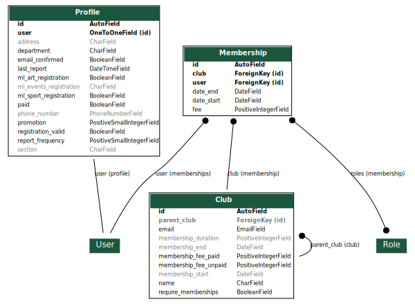

Application Member
==================

L'application ``member`` s'occcupe de la gestion des utilisateurs enregistrés. 

Le model d'utilisateur ``django.contrib.auth.model.User`` est complété par un ``Profile`` utilisateur.

Tous les utilisateurs peuvent être membre de ``Club``. Cela se traduit par une adhésion ``Membership``, dont les
caractéristiques sont propres à chaque club.

En pratique, la NoteKfet possède au minimum deux Club: **Bde** et **Kfet** (instanciés via les fixtures). Et tous
les personnes à jour de cotisation sont membre à minima de Bde.
Être adhérent du club Kfet permet d'utiliser sa note pour consommer.

Modèles
-------

Utilisateur
~~~~~~~~~~~

Le modèle ``User`` est directement implémenté dans Django et n'appartient pas à l'application ``member``, mais il est
bon de rappeler à quoi ressemble ce modèle.

* ``date_joined`` : ``DateTimeField``, date à laquelle l'utilisateur a été inscrit (*inutilisé dans la Note*)
* ``email`` : ``EmailField``, adresse e-mail de l'utilisateur.
* ``first_name`` : ``CharField``, prénom de l'utilisateur.
* ``is_active`` : ``BooleanField``, indique si le compte est actif et peut se connecter.
* ``is_staff`` : ``BooleanField``, indique si l'utilisateur peut se connecter à l'interface Django-admin.
* ``is_superuser`` : ``BooleanField``, indique si l'utilisateur dispose de droits super-utilisateurs, permettant n'importe quelle action en base de donnée (lecture, ajout, modification, suppression).
* ``last_login`` : ``DateTimeField``, date et heure de dernière connexion.
* ``last_name`` : ``CharField``, nom de famille de l'utilisateur.
* ``password`` : ``CharField``, contient le hash du mot de passe de l'utilisateur. L'algorithme utilisé est celui par défaut de Django : PBKDF2 + HMAC + SHA256 avec 150000 itérations.
* ``username`` : ``CharField`` (unique), pseudo de l'utilisateur.

Profil
~~~~~~

Le modèle ``Profile`` contient un champ ``user`` de type ``OneToOneField``, ce qui permet de voir ce modèle comme une
extension du modèle ``User``, sans avoir à le réécrire. Il contient diverses informations personnelles sur
l'utilisateur, utiles pour l'adhésion au BDE :

* ``user`` : ``OneToOneField(User)``, utilisateur lié à ce profil
* ``address`` : ``CharField``, adresse physique de l'utilisateur
* ``paid`` : ``BooleanField``, indique si l'utilisateur normalien est rémunéré ou non (utile pour différencier les montants d'adhésion aux clubs)
* ``phone_number`` : ``CharField``, numéro de téléphone de l'utilisateur
* ``section`` : ``CharField``, section de l'ENS à laquelle apartient l'utilisateur (exemple : 1A0, ...)

Clubs
~~~~~

La gestion des clubs est une différence majeure avec la Note Kfet 2015. La Note gère ainsi les adhésions des
utilisateurs aux différents clubs.

* ``parent_club`` : ``ForeignKey(Club)``. La présence d'un club parent force l'adhésion au club parent avant de pouvoir adhérer au dit club. Tout club qui n'est pas le club BDE doit avoir le club BDE dans son arborescence.
* ``email`` : ``EmailField``, adresse e-mail sur laquelle contacter le bureau du club.
* ``membership_start`` : ``DateField``, date à partir de laquelle il est possible d'adhérer à un club pour l'année suivante (si adhésions à l'année), en ignorant l'année. Par exemple, l'adhésion BDE est possible à partir du 31/08 par défaut, et c'est à cette date que les adhésions pour l'année future est possible.
* ``membership_end`` : ``DateField``, date maximale de fin d'adhésion. Pour le club BDE, il s'agit du 30/09 de l'année suivante. Si cette valeur vaut ``null``, la fin d'adhésion n'est pas limitée.
* ``membership_duration`` : ``PositiveIntegerField``, durée (en jours) maximale d'adhésion. Par exemple, le club BDE permet des adhésions maximales de 13 mois, soit 396 jours.
* ``membership_fee_paid`` : ``PositiveIntegerField``, montant de la cotisation (en centimes) pour qu'un élève normalien (donc rémunéré) puisse adhérer.
* ``membership_fee_unpaid`` : ``PositiveIntegerField``, montant de la cotisation (en centimes) pour qu'un étudiant normalien (donc non rémunéré) puisse adhérer.
* ``name`` : ``CharField``, nom du club.
* ``require_memberships`` : ``BooleanField``, indique si le club est un vrai club BDE qui nécessite des adhésions de club, ou s'il s'agit d'une note "pot commun" (organisation d'une activité, note de département, ...)

Adhésions
~~~~~~~~~

Comme indiqué précédemment, la note gère les adhésions.

* ``club`` : ``ForeignKey(Club)``, club lié à l'adhésion.
* ``user`` : ``ForeignKey(User)``, utilisateur adhéré.
* ``date_start`` : ``DateField``, date de début d'adhésion.
* ``date_end`` : ``DateField``, date de fin d'adhésion.
* ``fee`` : ``PositiveIntegerField``, montant de la cotisation payée.
* ``roles`` : ``ManyToManyField(Role)``, liste des rôles endossés par l'adhérent.

Rôles
~~~~~

Comme indiqué le modèle des adhésions, les adhésions octroient des rôles aux adhérents, qui offrent des permissions
(cf ``RolesPermissions`` dans la page des permissions). Le modèle ``RolesPermissions`` possède un
``OneToOneField(Role)``, qui implémente les permissions des rôles. Le modèle ``Role`` à proprement parler ne contient
que le champ de son nom (``CharField``).

Transactions d'adhésion
~~~~~~~~~~~~~~~~~~~~~~~

Si le modèle ``MembershipTransaction`` appartient à l'application ``note``, il est bon d'en parler ici.
Le modèle ``MembershipTransaction`` est une extension du modèle ``Transaction`` (application ``note``) qui est de type
polymorphique, et contient en plus des informations de base de la transaction un champ ``OneToOneField(Membership)``
faisant le lien entre l'adhésion et la transaction liée. Une adhésion club, si elle n'est pas gratuite,
génère en effet automatiquement une transaction de l'utilisateur vers le club (voir section adhésions).

Graphe
------

Adhésions
---------

La Note Kfet offre la possibilité aux clubs de gérer l'adhésion de leurs membres. En plus de réguler les cotisations
des adhérents, des permissions sont octroyées sur la note en fonction des rôles au sein des clubs. Un rôle est une
fonction occupée au sein d'un club (Trésorier de club, président de club, GCKfet, Res[pot], respo info, ...).
Une adhésion attribue à un adhérent ses rôles. Les rôles fournissent les permissions. Par exemple, le trésorier d'un
club a le droit de faire des transferts de et vers la note du club, tant que la source reste au-dessus de -50 €.
Une adhésion est considérée comme valide si la date du jour est comprise (au sens large) entre les dates de début et
de fin d'adhésion.

On peut ajouter une adhésion à un utilisateur dans un club à tout non adhérent de ce club. La personne en charge
d'adhérer quelqu'un choisit l'utilisateur, les rôles au sein du club et la date de début d'adhésion. Cette date de
début d'adhésion doit se situer entre les champs ``club.membership_start`` et ``club.membership_end``,
si ces champs sont non nuls. Si ``club.parent_club`` n'est pas nul, l'utilisateur doit être membre de ce club.
Le montant de la cotisation est fixé en fonction du statut normalien de l'utilisateur (``club.membership_fee_paid``
centimes pour les élèves et ``club.membership_fee_unpaid`` centimes pour les étudiants). La date de fin est calculée
comme ce qui suit :

* Si ``club.membership_duration`` est non nul, alors ``date_end`` = ``date_start`` + ``club.membership_duration``
* Sinon ``club``, ``date_end`` = ``date_start`` + 424242 jours (suffisant pour tenir au moins une vie)
* Si ``club.membership_end`` est non nul, alors ``date_end`` = min(``date_end``, ``club.membership_end``)

Si l'utilisateur n'est pas membre du club ``Kfet``, l'adhésion n'est pas possible si le solde disponible sur sa note est
insuffisant. Une fois toute ces contraintes vérifiées, l'adhésion est créée. Une transaction de type
``MembershipTransaction`` est automatiquement créée de la note de l'utilisateur vers la note du club, finalisant l'adhésion.

Réadhésions
~~~~~~~~~~~

Pour les clubs nécessitant des adhésions (de durée limitée), il est possible de réadhérer au bout d'un an. Dès lors
que le jour actuel est après ``club.membership_start`` + 1 an, ``club.membership_start`` et
``club.membership_end`` sont incrémentés d'un an.

Il est possible de réadhérer si :

* ``membership.date_start`` <= ``today`` <= ``membership.date_end`` (l'adhésion en cours est valide)
* ``membership.date_start`` < ``club.membership_start`` (si la date de début d'adhésion du club est postérieure à la date de début d'adhésion, qui a donc été mise à jour, on a changé d'année)
* Il n'y a pas encore de réadhésion (pas d'adhésion au même club vérifiant ``new_membership.date_start`` >= ``club.membership_start``)

Un bouton ``Réadhérer`` apparaît dans la liste des adhésions si le droit est permis et si ces contraintes sont vérifiées.
En réadhérant, une nouvelle adhésion est créée pour l'utilisateur avec les mêmes rôles, commençant le lendemain de la
date d'expiration de la précédente adhésion. Si on réadhère le 16 août pour une adhésion finissant le 30 septembre,
la nouvelle adhésion commencera le 1er octobre).

Pour supprimer une adhésion (en cas d'erreur), se rendre dans django admin et changer la date de fin d'adhésion,
sans oublier d'invalider la transaction d'adhésion.
