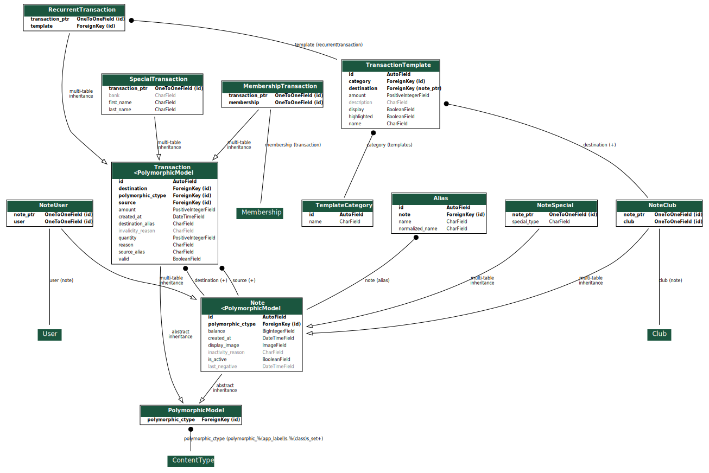

Application Note
================

L'application ``note`` gère tout ce qui est en lien avec les flux d'argent et les notes (balances) des utilisateurs.

La gestion des consommations s'effectue principalement via la page dédiée, dont le fonctionnement est expliqué
dans la page `Consommations <consumptions>`_.

Le fonctionnnemnent des  crédit/débit de note (avec le "monde extérieur" donc avec de l'argent réel) ainsi que les
transferts/dons entre notes est détaillé sur la page `Transferts <transactions>`_.

.. toctree::
   :maxdepth: 2
   :caption: Note

   consumptions
   transfers

Graphe
------

