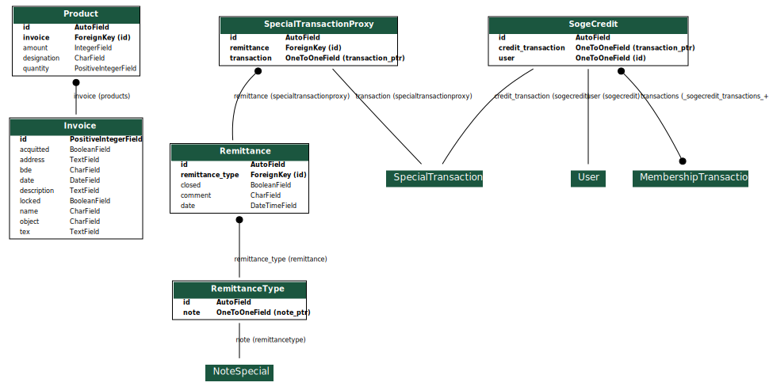

Application Trésorerie
======================

L'application de Trésorerie facilite la vie des trésorier, et sert d'interface de création de facture.
Elle permet également le suivi des remises de chèques reçus par le BDE et des crédits de la Société générale.

Factures
--------

Modèle des factures
~~~~~~~~~~~~~~~~~~~

Il est possible de créer des factures, qui seront enregistrées en base de données. Les différents attributs sont :

* ``id`` : Le numéro de la facture
* ``name`` : Le nom de la personne ou la raison sociale à qui est destinée la facture
* ``address`` : L'adresse de cette personne ou raison sociale
* ``bde`` : Le nom du fichier contenant le logo du BDE sous lequel a été éditée la facture. Ce champ ne peut pas être
  modifié depuis la note, et vaut par défaut le logo du BDE en fonction (exemple : ``Saperlistpopette.png``)
* ``date`` : Le jour d'émission de la facture (par défaut le jour même)
* ``object`` : L'objet de la facture, le titre
* ``description`` : La description de la facture
* ``acquitted`` : Indique si la facture a déjà été acquittée ou non.

Les factures contiennent également certaines valeurs hard-codées pour ne pas polluer la base de données, telle que
la raison sociale du BDE, son adresse ainsi que ses coordonnées bancaires.

Produits
~~~~~~~~

À chaque facture est associée plusieurs produits. Pour permettre cela, un modèle ``Product`` a été créé contenant 4 attributs :

  * ``invoice`` : ``ForeignKey`` vers la facture associée au produit
  * ``designation`` : Désignation du produit
  * ``quantity`` : Quantité achetée
  * ``amount`` : Prix unitaire (HT) du produit (peut être négatif si jamais il s'agit d'un rabais, d'un solde prépayé, ...)

Pour ajouter des produits à une facture, cela se passe sur le même formulaire d'ajout/de modification de factures.
Pour cela, on utilise un ``FormSet``, qui permet de gérer un nombre arbitraire de formulaires
(chaque produit est un sous-formulaire).

En en-tête, ce code HTML est généré automatiquement :

.. code:: html

    <input type="hidden" name="product_set-TOTAL_FORMS" value="<N>" id="id_product_set-TOTAL_FORMS">
    <input type="hidden" name="product_set-INITIAL_FORMS" value="<N>" id="id_product_set-INITIAL_FORMS">
    <input type="hidden" name="product_set-MIN_NUM_FORMS" value="0" id="id_product_set-MIN_NUM_FORMS">
    <input type="hidden" name="product_set-MAX_NUM_FORMS" value="1000" id="id_product_set-MAX_NUM_FORMS">

Où ``<N>`` est le nombre de produits initialement. Cela permet d'indiquer au FormSet combien de formulaires
il y a et combien il faut en gérer. La partie HTML de chaque produit ressemble à ceci :

.. code:: html

    <tr class="row-formset">
        <td><input type="text" name="product_set-__prefix__-designation" maxlength="255" id="id_product_set-__prefix__-designation"></td>
        <td><input type="number" name="product_set-__prefix__-quantity" min="0" id="id_product_set-__prefix__-quantity"> </td>
        <td>
        

            <input type="number" name="product_set-__prefix__-amount" step="0.01" id="id_product_set-__prefix__-amount">
            

                €
            

        

        </td>
        <input type="hidden" name="product_set-__prefix__-invoice" value="<INVOICE_ID>" id="id_product_set-__prefix__-invoice">
        <input type="hidden" name="product_set-__prefix__-id" id="id_product_set-__prefix__-id">
    </tr>

Où ``__prefix__`` est remplacé par le numéro de ligne et ``<INVOICE_ID>`` l'identifiant de la facture
(non renseigné si non encore créé). De cette manière, le FormSet sait associer chaque formulaire à ses données.
On note la présence de deux champs cachés :

  * ``product_set-__prefix__-invoice`` contient l'identifiant de la facture (si existant)
  * ``product_set-__prefix__-id`` contient l'identifiant du produit en base de données (si existant, sinon 0)

Deux boutons sont présents sur la page, pour ajouter et supprimer un produit. Cela a pour effet de mettre à jour
les informations présentes dans les méta-données du formulaire présentées ci-dessus, et de copier une ligne vide
(présentée ci-dessus) et de l'afficher en remplaçant ``__prefix__`` par les bonnes valeurs.

Au moment de la sauvegarde du formulaire, on s'assure d'enregistrer tous les produits associés.

Génération
~~~~~~~~~~

Les factures peuvent s'exporter au format PDF (là est tout leur intérêt). Pour cela, on utilise le template LaTeX
présent à l'adresse suivante :
`/templates/treasury/invoice_sample.tex <https://gitlab.crans.org/bde/nk20/-/tree/main/templates/treasury/invoice_sample.tex>`_

On le remplit avec les données de la facture et les données du BDE, hard-codées. On copie le template rempli dans un
ficher tex dans un dossier temporaire. On fait ensuite 2 appels à ``pdflatex`` pour générer la facture au format PDF.
Les deux appels sont nécessaires, il y a besoin d'un double rendu. Ensuite, le PDF est envoyé à l'utilisateur et on
supprime les données temporaires.

On remarque que les PDF sont générés à la volée et ne sont pas sauvegardés. Niveau performances, cela prend du temps
au plus 2-3 secondes), mais cela n'est pas un problème car on ne génère pas des factures fréquemment. Niveau fiabilité
des données, il faut s'assurer que les données hard-codées ne changent pas, et si elles sont amenées à changer
(pour cause de déménagement), il faudra s'assurer que cela n'impacte pas les anciennes factures, en ajoutant par
exemple un champ ``old`` (ou ``kchan``) pour savoir s'il s'agit d'une nouvelle ou d'une ancienne facture.

Remises de chèques
------------------

L'application trésorerie permet aussi de gérer les remises de chèques. En réalité, elle permet de gérer également des
remises de crédit par carte bancaire, virement ou espèces, mais cela n'étant pas utilisé, ces types de transactions
aparaîtront comme non supportées.

Différents modèles
~~~~~~~~~~~~~~~~~~

Types de remises
^^^^^^^^^^^^^^^^

Comme indiqué ci-dessus, tous les types de remises ne sont pas supportés. Pour cela, on passe par un modèle
``RemittanceType`` qui contient uniquement un champ ``OneToOneField`` vers un objet ``NoteSpecial``.
On peut alors voir ``RemittanceType`` comme un sous-ensemble des notes spéciales, qui correspond aux types de remises
supportées. Par défaut, seule la note ``Chèque`` est supportée (après chargement des données initiales).

L'intérêt de ce genre de procédé plutôt que d'ajouter un booléen dans le modèle ``NoteSpecial`` est d'empêcher toute
dépendance de l'application ``treasury`` dans l'application ``note``, la rendant plus externe.

Proxys vers transactions de crédit
^^^^^^^^^^^^^^^^^^^^^^^^^^^^^^^^^^

De la même manière que les types de remise, ce modèle, appelé ``SpecialTransactionProxy``, n'existe que pour rendre
l'application ``treasury`` externe et de ne pas surcharger le modèle ``SpecialTransaction``.

Ce modèle contient deux attributs :

* ``transaction`` : ``OneToOneField`` vers ``SpecialTransaction``
* ``remittance`` : ``ForeignKey`` vers ``Remittance`` (voir ci-dessous), remise associée à cette transaction

À chaque fois qu'une transaction spéciale d'un type accepté est créée, un proxy est ajouté automatiquement par le biais
d'un signal. De plus, à chaque fois que le serveur web démarre, les vieilles transactions d'un bon type sans proxy s'en
voient dotées d'un.

Remises
^^^^^^^

Les modèles des remises contiennent les attributs suivants :

* ``remittance_type`` : ``ForeignKey`` vers ``RemittanceType`` : type de remise (chèque, carte bancaire, virement, espèces)
* ``date`` : date et heure d'ouverture de la remise (``DateTimeField``)
* ``comment`` : commentaire sur la remise, description
* ``closed`` : booléen indiquant si la remise est close ou non

Ce modèle contient des propriétés supplémentaires :

* ``transactions`` : ``QuerySet<SpecialTransaction>``, transactions liées à la remise
* ``count`` : nombre de transactions liées
* ``amount`` : somme totale des transactions liées

Relations
~~~~~~~~~

* Toute transaction qui n'est pas attachée à une remise d'un bon type peut être attachée à une remise. Cela se passe
  par le biais d'un formulaire, où le trésorier peut vérifier et corriger au besoin nom, prénom, banque émettrice et montant.

* Toute transaction attachée à une remise encore ouverte peut être retirée.
* Pour clore une remise, il faut au moins 1 transaction associée.
* Il n'est plus possible de modifier de quelque manière que ce soit une remise close, que ce soit en modifiant le
  commentaire, en ajoutant ou en supprimant une transaction attachée.
* Il n'est pas possible de modifier le type d'une remise. De plus, il n'est pas possible d'ajouter une transaction à
  une remise si elle n'est pas du bon type.

Crédits de la Société générale
------------------------------

La note permet la gestion des crédits de la Société générale, conformément au partenariat établi entre la banque et le BDE.

Modèle
~~~~~~

Cette sous-application dispose d'un unique modèle "SogeCredit" avec les champs suivant :

* ``user`` : ``OneToOneField`` vers ``User``, utilisateur associé à ce crédit (relation ``OneToOne`` car chaque
  utilisateur ne peut bénéficier qu'une seule fois d'un crédit de la Société générale)
* ``transactions`` : ``ManyToManyField`` vers ``MembershipTransaction``, liste des transactions d'adhésion associées
  à ce crédit, généralement adhésion BDE+Kfet+WEI même si cela n'est pas restreint
* ``credit_transaction`` : ``OneToOneField`` vers ``SpecialTransaction``, peut être nulle, transaction de crédit de la
  Société générale vers la note de l'utilisateur si celui-ci a été validé. C'est d'ailleurs le témoin
  de validation du crédit.

On sait qu'un utilisateur a déjà demandé un crédit de la Société générale s'il existe un crédit associé à cet
utilisateur avec une transaction associée. Par ailleurs, le modèle ``Profile`` contient une propriété ``soge`` qui
traduit exactement ceci, et qui vaut ``False`` si jamais l'application Trésorerie n'est pas chargée.

Si jamais l'utilisateur n'a pas encore demandé de crédit de la Société générale (ou que celui-ci n'est pas encore validé),
l'utilisateur peut demander un tel crédit lors de son adhésion BDE, de sa réadhésion BDE ou de son inscription au WEI.
Dans les deux premiers cas, il est invité à jumeler avec une nouvelle adhésion Kfet (merci de d'abord se réadhérer au
BDE avant la Kfet dans ce cas).

Lorsqu'une telle demande est faite, l'adhésion est créée avec une transaction d'adhésion invalide. Cela implique que
la note source n'est pas débitée et la note destination n'est pas créditée.

Sur son interface, le trésorier peut récupérer les crédits de Société générale invalides. Deux options s'offrent à lui :

* Supprimer la demande. Dans ce cas, les transactions vont être validées, la note de l'utilisateur sera débité, les
  clubs seront crédités. Puisque la demande sera supprimée, l'utilisateur pourra à nouveau à l'avenir déclarer avoir
  ouvert un compte à la Société générale. Cette option est utile dans le cas où l'utilisateur est un boulet (ou pas,
  pour d'autres raisons) et a déclaré vouloir ouvrir un compte à la Société générale sans ne rien faire.
  Cette action est irréversible, et n'est pas possible si la note de l'utilisateur n'a pas un solde suffisant.

* Valider la demande. Dans ce cas, un crédit de la note "Virements bancaires" vers la note de l'utilisateur sera créé,
  la transaction sera liée à la demande via le champ ``credit_note`` (et donc la demande déclarée valide), et toutes les
  transactions d'adhésion seront déclarées valides.

* Demander à un respo info s'il y a un problème pour le régler avant de faire des bêtises. Je l'admets, ça fait trois options.

La validité d'une transaction d'adhésion n'a aucune influence sur l'adhésion elle-même. Toutefois, cela se remarque rapidement ...

.. image:: /_static/img/treasury_validate_sogecredit.png

Exemple de validation de crédit Société générale d'un étudiant non payé "toto2" s'étant inscrit au BDE, à la Kfet et au WEI.

Diagramme des modèles
---------------------

