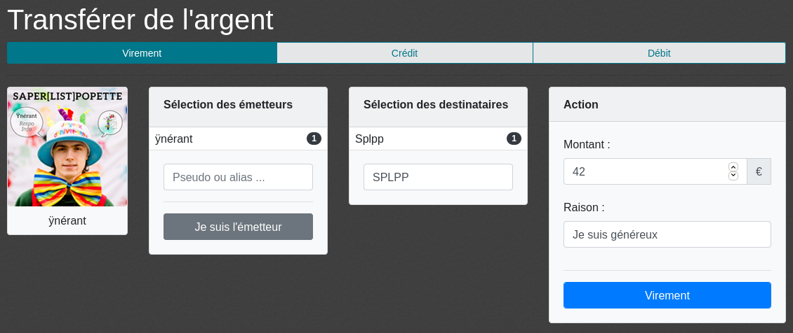

La note, c'est quoi ?
=====================

La Note Kfet est un porte-monnaie virtuel proposé gratuitement à tous les adhérents BDE.
C'est le moyen de paiement privilégié au sein du campus, que ce soit pour payer des
activités du BDE, ou bien pour faire des remboursements entre amis. La note contient
également la base d'adhérents du BDE et contient de nombreux outils facilitant la vie
des différents bureaux de clubs, en particulier les trésoriers et surtout les trésoriers
BDE.

La Note Kfet est accessible à l'adresse `<https://note.crans.org>`_. La version actuelle
a été développée par le BDE 2020-2021, et est maintenue par les respos infos du BDE de
l'ENS Paris-Saclay.

Fonctionnement général de la note
---------------------------------

C'est quoi une note ?
~~~~~~~~~~~~~~~~~~~~~

Chaque adhérent⋅e BDE dispose d'un compte appelé « note », créé lors de son adhésion.
Une note est associée à un solde en euros, et à un pseudo appelé « nom de note ».
Le solde associé à la note correspond au solde de l'adhérent⋅e, avec lequel il est
possible de payer tout ce qui est en lien avec le BDE. Le nom de note suffit à
identifier une personne, et il suffit par exemple de donner ce nom à un permanencier
à la Kfet pour acheter un produit.

Faire une transaction
~~~~~~~~~~~~~~~~~~~~~

Tout⋅e adhérent⋅e peut faire une transaction de sa note vers n'importe quelle note
d'un⋅e autre adhérent⋅e, pourvu que le montant de la transaction n'excède pas son
propre solde. Pour cela, il suffit d'aller sur la page de transferts, qui est la
page par défaut après connexion : `<https://note.crans.org/note/transfer/>`_
Le formulaire pour effectuer un transfert apparaît alors. En cliquant sur le bouton
« Je suis l'émetteur », le champ « Émetteurs » est directement complété avec votre
propre note. Il vous suffit alors de remplir le champ « Destinataires » avec le ou
les noms de note que vous voulez créditer, de spécifier le montant et la raison de
votre transfert, puis de cliquer sur le bouton « Virement ». Après quelques secondes,
si votre solde est suffisant et que la transaction est acceptée, un message de
confirmation apparaîtra et la transaction apparaîtra dans l'historique ci-dessous.

Consulter ses données personnelles
~~~~~~~~~~~~~~~~~~~~~~~~~~~~~~~~~~

La Note Kfet sert non seulement à faire des transactions d'argent virtuel au sein
du BDE, mais aussi à permettre au BDE et à ses clubs de gérer leurs adhérents.
À cet effet, diverses informations personnelles sont collectées par la Note.

Pour accéder à votre compte, une fois connecté⋅e, rendez-vous dans le menu en haut
à droite où se trouve votre pseudo. Votre solde est par ailleurs affiché à côté
de votre pseudo.

L'interface est divisée en trois parties :

 * Vos données personnelles dans la partie de gauche
 * Vos adhésions actives (si existantes) dans la partie haute
 * Vos transactions récentes dans la partie basse

Vous pouvez modifier vos données personnelles que la Note possède sur vous en
cliquant à tout moment sur le bouton « Modifier le profil ». Les informations
présentes sont :

 * Nom
 * Prénom
 * Pseudo
 * Adresse e-mail
 * Numéro de téléphone
 * Section
 * Département
 * Promotion
 * Adresse
 * Élève/étudiant
 * Inscription aux listes de diffusion du BDE, du BDA et du BDS

Les trois premières informations sont obligatoires pour pouvoir vous contacter
et pouvoir tenir un registre d'adhérent.

Le numéro de téléphone et l'adresse ne sont utilisés uniquement en cas d'urgence,
notamment en cas de WEI, et ne sont pas des champs obligatoires. De plus,
promotion, département et section ne sont utilisés sérieusement que en cas
de WEI, et ne sont pas utilisés sinon.

La distinction élève/étudiant permet de distinguer les achats qui peuvent avoir
des prix différents pour les élèves et pour les étudiants, notamment en cas de
transferts d'argent, de WEI ou d'adhésion à certains clubs.

Hormis le pseudo, toutes ces informations ont un caractère confidentiel qui les
rend privées et inaccessible aux utilisateurs. Les trésoriers BDE et les respos
info ont accès à toutes les informations (en cas de besoin uniquement, le cas
contraire est considéré comme de l'abus de droit qui est punissable), et les
trésoriers de club ont accès au nom et au prénom afin de faciliter l'association
à un nom de note.

Dans la partie informations personnelles, il est également possible de modifier
la liste de ses alias (voir la section sur les alias), et de voir son propre
solde. Il est enfin possible de modifier l'image associée à la note, qui n'a
quant à elle pas de caractère privée puisqu'elle est affichée à chaque recherche
de nom de note.

Le tableau des adhésions actives sur la partie du haut contient l'ensemble des
clubs auxquels vous êtes adhérent⋅es, avec les dates de début, de fin, votre
rôle au sein du club (généralement simple membre, mais cela peut également
être trésorier⋅ère par exemple) ainsi que la cotisation que vous avez éventuellement
payée au club.

L'historique des transactions contient l'ensemble des transactions qui ont fait
intervenir votre note, triées par date décroissante. Il est possible en cliquant
sur le lien « Historique des transactions » d'avoir un meilleur aperçu, notamment
pour pouvoir filtrer des transactions.
